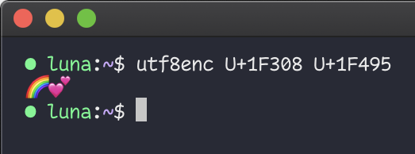

# utf8enc


**utf8enc** is a tiny utility that reads an argument list of unicode codepoints, and outputs them as UTF-8 characters.



## Building & Installing

On macOS and Linux, it _should_ be as simple as running the following inside the `utf8enc` directory:

```
make && make install
```

Windows is not _officially_ supported, but it'll likely work under WSL.
